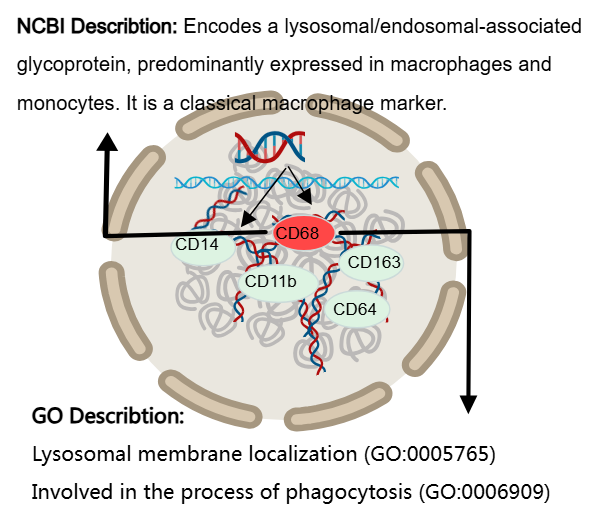
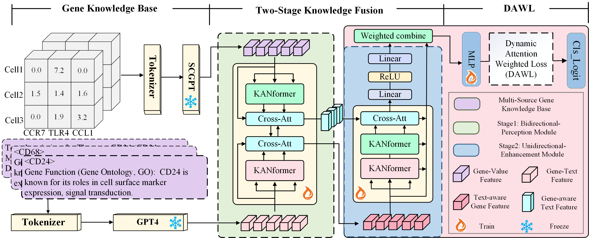

# Knowledge-Augmented Gene Language Model: A New Paradigm for Single-Cell Annotation under Long-Tail Distribution

This repository accompanies the manuscript **"Knowledge-Augmented Gene Language Model: A New Paradigm for Single-Cell Annotation under Long-Tail Distribution"** 

# Summary
In single-cell bioinformatics analysis, integrating multi-source gene knowledge is crucial for enhancing both the biological interpretability and accuracy of cell annotation. To address the challenge of annotating rare cell types caused by the long-tailed distribution in single-cell data, this paper proposes a novel Knowledge-Augmented Gene Language Model (KAGLM), establishing a new paradigm for single-cell annotation. We constructed a Multi-Source Gene Knowledge Base by integrating structured databases and unstructured information from scientific literature, effectively supplementing the insufficient prior knowledge of rare cell types in raw sequencing data. To efficiently integrate knowledge features with raw sequencing data, we designed an innovative Two-Stage KANformer-Fusion Framework, consisting of a Bidirectional-Perception Module for feature interaction and a Unidirectional-Enhancement Module for knowledge-enhanced modeling.
To tackle the long-tailed distribution problem, we further propose a Dynamic Attention Weighted Loss (DAWL) mechanism, which significantly improves the model's ability to recognize rare cell types. Extensive experiments on multiple public and in-house single-cell datasets demonstrate that the proposed Knowledge-Augmented Gene Language Model outperforms existing mainstream methods in annotation accuracy and generalization ability, providing a powerful tool and theoretical foundation for the intelligent analysis of single-cell data.

---


---

## 1. Setting up the Environment

We recommend using Conda to manage environments. Clone this repository and install dependencies as follows:

```bash
conda create -n RAGLM python=3.10
conda activate RAGLM
pip install -r requirements.txt
```

## 2.  Models

We were inspired by Retrieval-Augmented Generation (RAG) technology to construct a multi-source knowledge base centered on gene information, aiming to enhance the model's ability to acquire prior knowledge for single-cell annotation.




### The executable code for reproducing LBCL dataset.

```
python .example/LBCL_NCBI_kan_each.py
```

### The executable code for reproducing human_atlas dataset.

```
python .example/human_atlas_NCBI_kan_each.py
```

### The executable code for reproducing optic2 dataset.

```
python .example/optic2_NCBI_kan.py
```

### The executable code for reproducing optic3 dataset.

```
python .example/optic3_NCBI_kan_each.py
```

